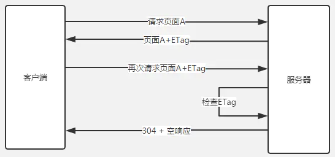

## 资源

[深入理解浏览器的缓存机制](https://www.jianshu.com/p/54cc04190252)

[HTTP Cache 缓存机制](https://www.jianshu.com/p/85adc560adbe)

[MDN Cache-Control](https://developer.mozilla.org/zh-CN/docs/Web/HTTP/Headers/Cache-Control)

## 缓存目的

  通过复用资源，可以提高网站和应用程序的性能。web 缓存减少了延迟和网络流量，减少显示资源所需要的时间

  &nbsp;

## 缓存应用场景

1. 按资源有效期判断

  

  如图所示，有部分资源服务器第一次响应时会返回 max-age 或者 expires 告知浏览器，该资源在该时间范围内不产生变化。浏览器收到该信息后，下次请求时，会先检查 max-age 和 expires，如果在有效时间内，则直接从 cache 中读取。

  

  * 应用场景：静态资源，如图片、js、css、html
  * Status Code：200 OK (from memory cache)
  * 缓存读取方式：memory cache (有生命周期的)

  &nbsp;

2. 按资源的内容判断

  


  当资源不满足 (1) 的缓存策略，无法从 memory cache 中获取数据时，并不意味着缓存策略失效，还可以通过与服务器沟通来进一步确定。(1) 中的活动图按(2)进一步拓展为 (注意活动图的 Before max-age 与 Before expired date 不一定存在，response 存在时才需要判断)：

  

  * 应用场景：动态API、动态页面、过期的静态资源
  * Status Code： 304 Not modified (from disk cache)
  * 缓存读取方式：disk cache

  &nbsp;

## 缓存分类

  

  #### Private browers caches 私有浏览器缓存

  * 专用于某单个用户，中间人不能缓存此响应。比如：一个用户的浏览器可以带有用户私有信息，但是 CDN 无法缓存页面

  ```html
    Cache-Control: private
  ```

  #### Shared proxy caches 共享代理缓存

  * 共享缓存可以被多个用户使用，可以被任何中间人（比如：中间代理，CDN等）缓存

  ```html
    Cache-Control: public
  ```

  &nbsp;

## Request 和 Response 相关的缓存设置参数

### Expires
  &nbsp;

  浏览器收到 response header 后，会将资源存储起来，然后等到下一次访问同一请求时，会检查【当前时间】是否超过这个【Expires】。如果没有超过，则浏览器不发请求，直接从 disk cache 直接取，Status code 会标记为：Status code 200 (from disk cache)

  ``` bash
    Response Headers:
        Expires: Wed, 21 Oct 2017 07:28:00 GMT
  ```

  1. 该时间是 GMT 时间，而不是本地时间
  2. Cache 的到期时间，由服务器端定义
  3. 浏览器对该时间的判断依赖于客户端，修改客户端时间，导致缓存失效

  &nbsp;

### Cache-Control
  &nbsp;

  通用消息头字段，被用于在http请求和响应中，通过指定指令来实现缓存机制。缓存指令是单向的，这意味着在请求中设置的指令，不一定被包含在响应中。


  ``` bash
    # 缓存请求指令
    # 客户端可以在HTTP请求中使用的标准 Cache-Control

    # 设置缓存存储的最大周期，超过这个时间缓存被认为过期(单位秒)。与Expires相反，时间是相对于请求的时间。可以有效解决 Expires 的客户端时间依赖问题
    Cache-Control: max-age=<seconds>

    # 浏览器用不到，浏览器不会主动设置该值，只有在发起端设置是有用的，服务端返回的内容中设置没有用。发起请求方，主动带的头，在max-age过期之后，如果我们返回的资源中有这个max-stale设置，还可以使用过期的缓存，而不需要去服务器请求新的内容。如果未指定参数值，则表示无论过期多长时间都会接收
    Cache-Control: max-stale[=<seconds>]

    # 要求缓存服务器返回至少还未过指定时间的缓存资源。当指定 min-fresh=60 后，过了60秒的资源都无法作为响应返回了
    Cache-Control: min-fresh=<seconds>

    # 有缓存，但是不直接使用缓存，需要经过校验
    Cache-control: no-cache

    # 完全没有缓存，所有的资源都需要重新发请求
    Cache-control: no-store

    # 无论在请求还是响应中，缓存都不能改变实体主体的媒体类型。这样可防止缓存或代理压缩图片等类似操作
    Cache-control: no-transform

    # 表示客户端仅在缓存服务器本地缓存目标资源的情况下才会要求其返回。该指令要求缓存服务器不重新加载响应，也不会再次确认资源有效性。若发生请求缓存服务器的本地缓存无响应，则返回状态码 504 Gateway Timeout
    Cache-control: only-if-cached
  ```

  ```bash
    # 缓存响应指令
    # 服务器可以在响应中使用的标准 Cache-Control 指令

    # 通知浏览器和缓存服务器，在本地缓存无论过期与否，都需要和服务器进行有效性验证。如果服务器不可用则返回 504 Gateway Timeout
    Cache-control: must-revalidate
    Cache-control: no-cache
    Cache-control: no-store
    Cache-control: no-transform
    Cache-control: public
    Cache-control: private

    # 要求所有的缓存服务器在接收到客户端带有该指令的请求返回响应之前，必须再次验证缓存的有效性
    Cache-control: proxy-revalidate

    Cache-Control: max-age=<seconds>

    # 功能和 max-age 相同，但是仅适用于 public 类型，优先级高于 Expires 和 max-age
    Cache-control: s-maxage=<seconds>
  ```

  ``` bash
    #  扩展Cache-Control指令

    Cache-control: immutable
    Cache-control: stale-while-revalidate=<seconds>
    Cache-control: stale-if-error=<seconds>
  ```

  1. 优先级高于Expires，如果同时设置了Cache Control 和Expires， Expires会被忽略
  2. Cache-Control标头被定义为 HTTP/1.1规范的一部分，并且取代了原先用于定义response缓存策略的Expire等，现在所有的现代浏览器都支持HTTP Cache-Control
  3. max-age 和 max-stale 在请求中同时使用的情况下，缓存的时间可以为max-age和max-stale的和

  &nbsp;

### Last-Modified 与 If-Modified-Since

  &nbsp;

  * 浏览器在第一次访问资源时，服务器返回资源的同时，在response header中添加 Last-Modified的header，值是这个资源在服务器上的最后修改时间，浏览器接收后缓存文件和header。

    ```bash
      Response Headers:
        Last-Modified: 2017-01-01 13:00:00
        Cache-Control: max-age=31536000
    ```

  * 浏览器下一次请求这个资源，浏览器检测到有 Last-Modified这个header，于是添加If-Modified-Since这个header，值就是Last-Modified中的值；服务器再次收到这个资源请求，会根据 If-Modified-Since 中的值与服务器中这个资源的最后修改时间对比，如果没有变化，返回304和空的响应体，直接从缓存读取，如果If-Modified-Since的时间小于服务器中这个资源的最后修改时间，说明文件有更新，于是返回新的资源文件和200。

    

  * 存在问题:

    * 如果本地打开缓存文件，即使没有对文件进行修改，但还是会造成 Last-Modified 被修改，服务端不能命中缓存导致发送相同的资源

    * 因为 Last-Modified 只能以秒计时，如果在不可感知的时间内修改完成文件，那么服务端会认为资源还是命中了，不会返回正确的资源

    既然根据文件修改时间来决定是否缓存尚有不足，能否可以直接根据文件内容是否修改来决定缓存策略？所以在 HTTP / 1.1 出现了 ETag 和If-None-Match


  &nbsp;

### Etag 和 If-None-Match

  &nbsp;

  * ETag 是 Entity Tag 的简写，是一个资源版本的唯一标识，类似于一个资源的对应的 hash code。

  * 如果一个 response 有 ETag，那么浏览器下一次访问该资源时，会在请求的头部加上 If-None-Match，如果 Server Response 返回的 ETag 一样，那么表示内容没有变化，返回 ==Status code: 304 (Not Modified)==。浏览器就通过从 cache 中重新获取数据。

    

  * Etag 分类 (Strong | Weak)

    ```bash
      # Strong ETag indicates that resource content is same for response body and the response headers.
      "543b39c23d8d34c232b457297d38ad99"    – Strong ETag

      # Weak ETag indicates that the two representations are semantically equivalent. It compares only the response body.
      W/"543b39c23d8d34c232b457297d38ad99"  – Weak ETag
    ```

  * Rails 4 默认使用的是 Strong ETag, Rails5 默认使用的是 Weak ETag

  &nbsp;

### Etag 和 Last-Modified 对比

  &nbsp;

  * 精确度上，Etag要优于Last-Modified。Last-Modified的时间单位是秒，如果某个文件在1秒内改变了多次，那么他们的Last-Modified其实并没有体现出来修改，但是Etag每次都会改变确保了精度；如果是负载均衡的服务器，各个服务器生成的Last-Modified也有可能不一致。

  * 性能上，Etag要逊于Last-Modified，毕竟Last-Modified只需要记录时间，而Etag需要服务器通过算法来计算出一个hash值。

  * 第三在优先级上，服务器校验优先考虑Etag

  &nbsp;

## 用户行为对浏览器缓存的影响

  &nbsp;

  * 打开网页，地址栏输入地址： 查找 disk cache 中是否有匹配。如有则使用；如没有则发送网络请求。

  * 普通刷新 (F5)：因为 TAB 并没有关闭，因此 memory cache 是可用的，会被优先使用(如果匹配的话)。其次才是 disk cache。

  * 强制刷新 (Ctrl + F5)：浏览器不使用缓存，因此发送的请求头部均带有 Cache-control: no-cache(为了兼容，还带了 Pragma: no-cache),服务器直接返回 200 和最新内容。


